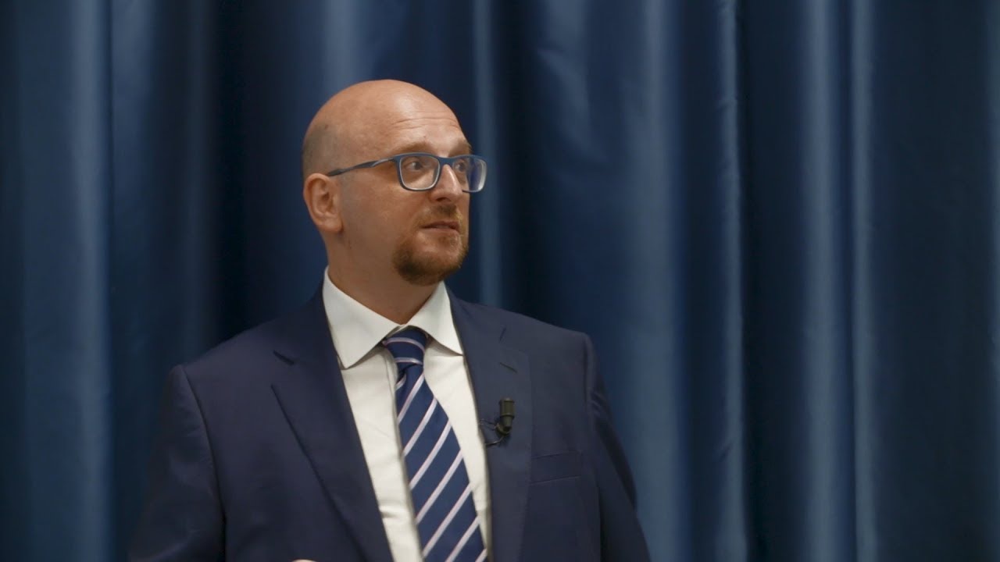

* [Digital Gold Institute](http://www.dgi.io)  
  Executive Director  
  <http://www.dgi.io>

* Università Milano-Bicocca - Department of Statistics and Quantitative Methods  
  Adjunct Professor
  <https://www.unimib.it/ferdinando-maria-ametrano>

* Politecnico di Milano - Department of Mathematics  
  Adjunct Professor

* [QuantLib](http://www.quantlib.org)  
  Founder and co-admin  
  <http://www.quantlib.org>

---

Executive Director of the
[Digital Gold Institute](http://www.dgi.io),
Ferdinando Ametrano teaches
"[Bitcoin and Blockchain Technology]({{ site.baseurl }}/bbt/)"
at Politecnico di Milano and Milano-Bicocca University.
Former [Head of Blockchain and Virtual Currencies](https://goo.gl/QdDTuN)
in Intesa Sanpaolo bank, he has been Planning Committee member of the
[Scaling Bitcoin Conference](https://scalingbitcoin.org/)
that he chaired in [Milan 2016](https://milan2016.scalingbitcoin.org/).

Fintech innovator, technologist, and open source developer,
he is author of [scientific publications]({{ site.baseurl }}/papers/)
and contributor to multiple [media]({{ site.baseurl }}/media/) outlets.
Appreciated [professor]({{ site.baseurl }}/courses/), speaker, panelist, lecturer, and instructor, he has been
invited to [events]({{ site.baseurl }}/events/)
about bitcoin at the
[United Nations](https://www.youtube.com/watch?v=VbwUwioZ9F0&t=330s&index=10&list=PLrVvuryXHYTezxoQBL7Lw3svQEVd2uTzZ),
central banks, the Italian Parliament, universities, conferences, and
workshops.

His [academic research]({{ site.baseurl }}/papers/)
focuses on price stability, advocating
automated non-discretionary elastic monetary policy for a new generation
of cryptocurrencies ([Hayek Money](https://ssrn.com/abstract=2425270)).

He is also founder and co-administrator of the
[QuantLib](https://www.quantlib.org) project,
a comprehensive free/open-source software framework for quantitative finance.
[Interest Rate Derivatives]({{ site.baseurl }}/ird/) Adjunct Professor at the
Milano-Bicocca University, he has
[relevant publications](https://ssrn.com/author=510135) on this subject and
has headed trading, quantitative, and risk-management teams in Banca IMI
(Intesa Sanpaolo), Banca Caboto and Monte Paschi Asset Management; he has
also been co-founder and managing partner of RiskMap
(now [StatPro](https://www.statpro.com/) Italia).

---

**email contact form**: <https://bit.ly/contactametrano>

<https://github.com/fametrano>  
<https://ssrn.com/author=510135>  
<https://onename.com/nando1970>  
<https://medium.com/@nando1970>  
<https://twitter.com/Ferdinando1970>  
<https://speakerdeck.com/nando1970>  
<https://www.reddit.com/user/Nando1970>  
<https://www.slideshare.net/Ferdinando1970>  
<https://www.facebook.com/ferdinando.ametrano>  
<https://www.linkedin.com/in/ferdinandoametrano>  
<https://www.youtube.com/c/FerdinandoMAmetrano>  
<https://scholar.google.com/citations?user=dFSSrwwAAAAJ>

Bitcoin public address for receiving donation and message signing: [1FEz167JCVgBvhJBahpzmrsTNewhiwgWVG](bitcoin:1FEz167JCVgBvhJBahpzmrsTNewhiwgWVG)

